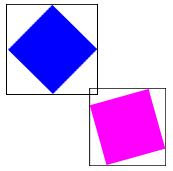
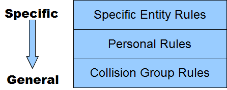

# **Collision Rules**
A way to manage to interaction between entities and their environment.

## 1 | Introduction
The collision rules system allows precise control over how entities and groups of entities interact with each other. Every possible collision between two collidable objects is controlled by one of these collision rules.

To understand exactly how this system works, it helps to first understand how the collision pair system works.

### 1.A | BroadPhase: Creating a Collision Pair
The first stage in the pipeline, known as “broad phase” collision detection, determines which collidable objects are in danger of colliding. Each collidable object has its own axis-aligned bounding box which fully contains the collision shape of the collidable object. A bounding box overlap signifies a potential collision pair, such as in the image below.

The BroadPhases of BEPUphysics identify these pairs using various acceleration structures. The current recommended BroadPhase, DynamicHierarchy, uses incrementally updated hierarchical bounding volumes that can be traversed for quick pair finding.

Once a bounding box overlap is found, the pair is tested for validity. To be valid, a pair must pass a few internal tests as well as the user-defined CollisionRule, described later. A validated pair is added to the list of CollisionPairs in the space. Note that a valid collision pair does not necessarily mean that the geometry of the collidable objects is intersecting.

### 1.B | Contact Generation
The second stage, termed "narrow phase" collision detection, looks at the overlaps found by the broad phase and creates pair handlers based on the type of collidables involved.&nbsp; These pair handlers are responsible for collecting detailed information about a collision. If any geometry intersection is found, data such as collision location, surface normal, and penetration depth are stored inside Contact objects, which represent individual contact points.

Every contact generation algorithm works by creating a set of these Contacts that approximate the touching area between two shapes. A single corner touching another shape could be represented by a single contact point, an edge-surface collision by two contact points, and a surface-surface by three or four contact points.

### 1.C | Collision Response
The last stage calculates how to make each shape react to the collisions it is a part of. Each individual Contact can be thought of as a constraint that disallows penetration between two objects.

BEPUphysics iterates over all of these Contact constraints repeatedly to converge towards a solution that satisfies every constraint.

## 2 | User-Defined Collision Rules
Through specifying collision rules, it is possible to selectively stop the collision pair system at an arbitrary point in the pipeline. There are multiple entries in the CollisionRule enumeration that represent these different stages:

*   **CollisionRule.Defer**: Defers the decision over a collision rule to the next lower priority stage in the CollisionRule system, explained later.

*   **CollisionRule.Normal**: Allows a collision pair to undergo every aspect (broad phase, narrow phase, collision response) in the collision pipeline.

*   **CollisionRule.NoSolver**: Allows a collision pair to undergo broad phase and narrow phase testing, but does not solve collision constraints.

*   **CollisionRule.NoNarrowPhaseUpdate**: Allows a collision pair to undergo broad phase and the first part of narrow phase testing,&nbsp; resulting in a pair handler instance but no updates to that pair handler.

*   **CollisionRule.NoNarrowPhasePair:** Allows a collision pair to undergo broad phase but not narrow phase testing.&nbsp; The BroadPhase will output an overlap for the pair, but the narrowphase will disregard it and no further testing will occur.

*   **CollisionRule.NoBroadPhase**: Prevents an overlap from being detected between two objects. No further testing occurs.

### 2.A | Collision Rule Options
Every collidable object (including StaticMeshes, Terrains, InstancedMeshes, and each entity.CollisionInformation) has a CollisionRules property containing three different settings which are combined and tested against other entities to determine a collision pair's ultimate CollisionRule. As a rule of thumb, the more specific rules take precedence over the more general rules.

*   **Specific**: Dictionary containing a listing of other CollisionRules instances and what CollisionRule is associated with them. Entities not contained within the list are considered to have a relationship of CollisionRule.Defer.

*   **Personal**: CollisionRule of the object. Defaults to CollisionRule.Defer.

*   **Group**: CollisionGroup of the object. When added to a space, an object will receive a default collision group if a different one has not already been set.

### 2.B | Collision Groups
The CollisionGroup setting offers a significant amount of control. In a collision pair, unless the CollisionRule is determined before the collision groups are considered (as explained later), the two colliding objects' CollisionGroups are tested against each other.

To perform this test, the CollisionRules.CollisionGroupRules dictionary is accessed. This dictionary contains entries with keys of CollisionGroup pairs and values of CollisionRules. New relationships can be added to this dictionary, though it by default includes a relationship only between the DefaultKinematicCollisionGroup and itself (CollisionRule.NoBroadPhase, since kinematic objects shouldn't collide with other kinematic objects by default).

To use custom collision groups, simply create a new CollisionGroup instance. You can reuse this instance across all the collidable objects that you want by setting the CollisionRules.Group field of each one.

 Then, create a CollisionGroupPair using that new group and any other group and add it to the CollisionRules.CollisionGroupRules dictionary with whatever CollisionRule type you'd like. You can also add and modify the CollisionRules of the default CollisionGroups. The CollisionGroup class contains a variety of static helper functions to make rule assignment between CollisionGroups and sets of CollisionGroups easier.

### 2.C | Combining Collision Rules
Since there are three different settings for each collidable object in a pair, some computation must be done to determine what CollisionRule to use for the collision pair. This is done through prioritizing more specific rules over more general relationships. The Specific rules are considered the most specific, the personal rules are in the middle, and the collision groups are the most general.

The Specific rule, if defined, overrides the personal rule which, if defined, overrides the group rule. If after going through all stages no CollisionRule has been defined, the CollisionRules.DefaultCollisionRule is returned.

In the Specific rule, each collidable object can consider the other with a different CollisionRule since each object has its own Specific dictionary. Similarly, each collidable object can have its own personal rule. Since it is possible for rules of equal priority to contradict each other, the most severe 'restriction' is used at a given priority level. From most severe restriction to least severe, the CollisionRules are ordered as follows: NoBroadPhase, NoNarrowPhasePair, NoNarrowPhaseUpdate, NoSolver, Normal.

## 3 | Advanced

There are a few extra details which can be leveraged for more control and are necessary for a complete understanding of how the collision rule system works.

### 3.A | Changing Collision Rules

Internally, the CollisionRule for a collision pair is computed before the pair can be validated by the BroadPhase. This allows the validation method to test for CollisionRule.NoBroadPhase rule, which prevents an overlap from being created.

The CollisionRule computed by the BroadPhase is passed to the pair instance after it is created. It will not be recomputed for the lifespan of the pair. However, since the CollidablePairHandler.CollisionRule property is public, it can be modified later.

One useful application of this is using immediate entity events (those with present tense naming, like CreatingContact) to allow arbitrary code to be executed right in the middle of the engine's execution. It is possible to intercept a pair handler once it is created (or after a variety of other events) and, based on whatever conditions desired, modify the pair's CollisionRule.

It is also possible to use the same instance of CollisionRules for multiple collidable objects if you wish to re-use the same settings. To accomplish this, simply set the CollisionRules property to the other instance.

### 3.B | Special Cases

At some points in the engine, certain combinations of settings are ignored in favor of some internal test. One example of this is the BroadPhase's requirement that at least one of the entities in a collision pair must be active in order for the collision pair instance to be created. This overrides the bounding box overlap test and the collision rule test.

Additionally, for two kinematic entities in a collision pair with a CollisionRule of CollisionRule.Normal, no collision response will take place. In effect, the engine considers the CollisionRule to be CollisionRule.NoSolver since kinematic entities cannot undergo collision response.

### 3.C | Custom Rule Calculation

Every BroadPhase object has a CollisionRuleCalculator delegate which is called to determine the collision rule of a pair of collidable objects. This is stored in the BroadPhase's CalculateCollisionRuleCallback field.

By default, CalculateCollisionRuleCallback is set to the EntityCollisionRules.GetCollisionRule static method. A custom method can be used as the callback to perform alternate logic.