# **Joints and Constraints**
Make fancy contraptions, ragdolls, and more.

## **1 | What are Joints and Constraints?**
In physics engines and simulation, the term _constraint_ is commonly used to mean a physical limitation that enforces some requirement on one or more objects. Constraints can limit the range of allowed movement and change the way dynamic objects act.

A joint is a type of constraint. In BEPUphysics, joints can bind entities together in many different ways, such as door hinges and wheel axes.

The set of constraints in a simulation can be thought of as equations that need to be satisfied to figure out how entities can move. BEPUphysics uses a _solver_ to compute the result. That's where the name SolverUpdateable comes from. SolverUpdateable provides the interface the solver needs to function.

Due to its generality, SolverUpdateables can take on many different forms, from the standard two body joint to customizable groups of multiple other SolverUpdateables. The following goes in depth on the variety of joints available.

## **2 | Joints**
The Joint class in BEPUphysics connects two entities together. All Joints restrict some degrees of freedom, seeking a specific configuration.

### 2.A | BallSocketJoint
The BallSocketJoint restricts all three linear degrees of freedom. Each entity has a point attached and the constraint attempts to keep the two points at the same location.

BallSocketJoints are very common and act as the linear component of many constraint configurations. For example, in a ragdoll, every joint has a BallSocketJoint to keep the body together (along with other constraints to handle angular motion). 
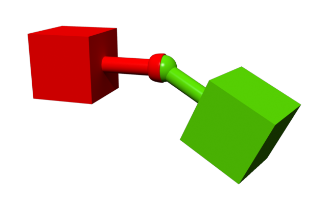

### 2.B | DistanceJoint
The DistanceJoint removes a single linear degree of freedom. Each entity has a point attached and the constraint attempts to keep them at the same distance.

A target distance of zero will be difficult to maintain since the constraint only works on a single degree of freedom instead of three. If zero distance is desired between the anchor points, consider using a BallSocketJoint.

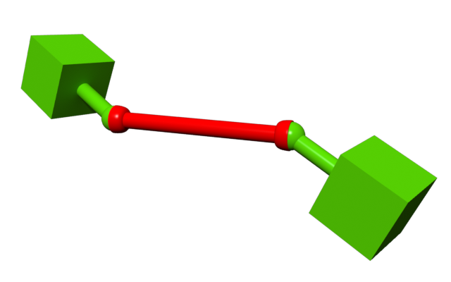

### 2.C | PointOnLineJoint
The PointOnLineJoint restricts two linear degrees of freedom. An infinite line is attached to entity A and a point is attached to entity B. The constraint attempts to keep the point on the line.

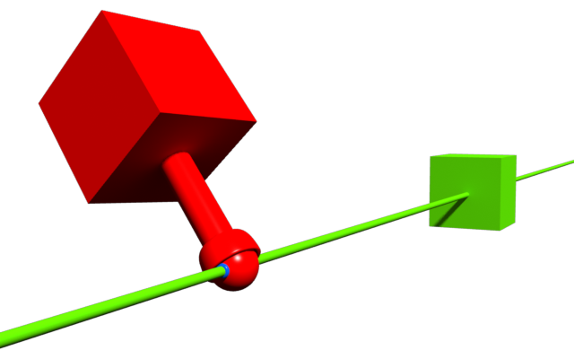

### 2.D | PointOnPlaneJoint
The PointOnPlaneJoint restricts one linear degree of freedom. An infinite plane is attached to entity A and a point is attached to entity B. The constraint attempts to keep the point on the plane.

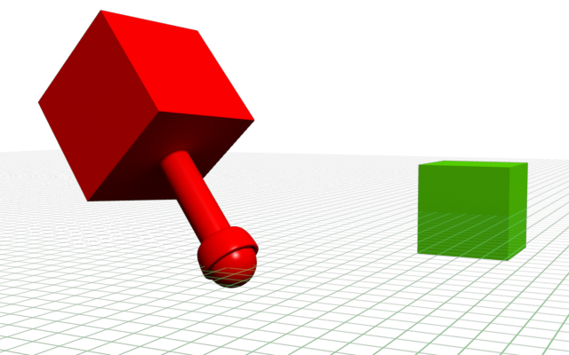

### 2.E | TwistJoint
The TwistJoint restricts one angular degree of freedom. Each entity has an axis attached and the constraint attempts to prevent any relative twisting motion around the axes.

TwistJoints have a singularity that can cause instability when the axes are folded back onto themselves. Prevent this configuration from occurring using other limits or by ensuring the connected physical entities will collide before it can happen.

TwistJoints can be used to create the angular part of a universal joint. See the UniversalJoint description for more information and a picture.

### 2.F | NoRotationJoint
The NoRotationJoint restricts all three angular degrees of freedom. The constraint attempts to keep the relative orientation of the two connected entities the same throughout the simulation.

NoRotationJoints can be used to create fixed constraints. See the WeldJoint for more information and a picture.

### 2.G | RevoluteAngularJoint
The RevoluteAngularJoint restricts two angular degrees of freedom. The connected entities can rotate around a specified free axis relative to each other.

The RevoluteAngularJoint handles the angular degrees of freedom for the RevoluteJoint. See it for more information and a picture.

### 2.H | SwivelHingeAngularJoint
The SwivelHingeAngularJoint restricts one angular degree of freedom. The free hinge axis is attached to entity A and the free twist axis is attached to entity B. The constraint attempts to keep the free hinge axis and free twist axis perpendicular to each other. 

The SwivelHingeAngularJoint handles the angular degrees of freedom for the SwivelHingeJoint. See it for more information and a picture.

## **3 | JointLimits**
JointLimits restrict degrees of freedom to an allowed range.

### 3.A | DistanceLimit
The DistanceLimit restricts one linear degree of freedom. Each entity has a point attached and the constraint attempts to keep the points at a distance no greater than the maximum limit and no less than the minimum limit. DistanceLimits can be used to implement rope-like behavior, though the constraint has no physical form and the 'rope' can pass through solid objects.

In the following picture, the outer gray shell represents the maximum distance that the blue point can move away from the inner red point. The inner yellow shell represents the minimum distance that must be maintained between the red and blue points.

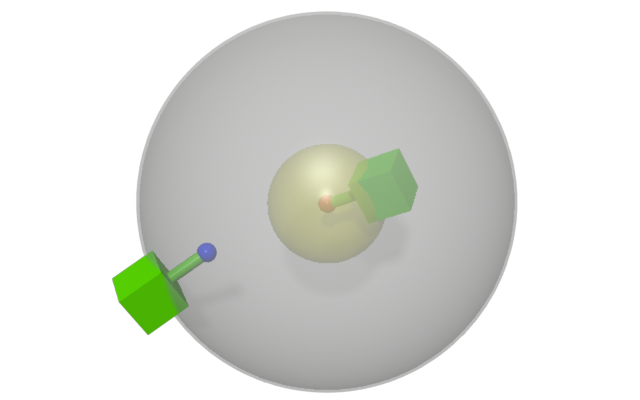

### 3.B | EllipseSwingLimit
The EllipseSwingLimit restricts one angular degree of freedom. Each entity has an axis attached. The constraint attempts to keep the axes at an angle no greater than the angle limit defined by an ellipse.

EllipseSwingLimits are commonly used in shoulder-like joints with complicated allowed motion.

### 3.C | LinearAxisLimit
The LinearAxisLimit restricts one linear degree of freedom. A point and axis are attached to entity A and a point is attached to entity B. The constraint attempts to keep entity B's point from moving beyond the minimum or maximum distance along the axis from entity A's point.

One common application of the LinearAxisLimit is to keep entities attached with a PointOnLineJoint from sliding away from each other.

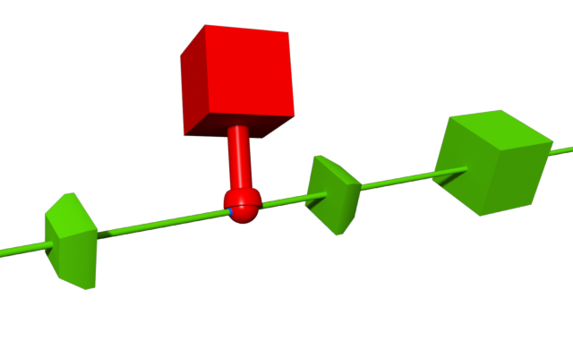

### 3.D | RevoluteLimit
The RevoluteLimit restricts one angular degree of freedom, complementing the RevoluteAngularJoint. An axis is attached to entity A and another axis is attached to entity B. The constraint measures the angle of entity B's axis relative to entity A's axis around the swing axis and attempts to keep it within the allowed limits.

Examples of RevoluteLimits can be found in elbow joints, knees, and door hinges. In the following example of a modified RevoluteJoint, the tab on the hinge simulates the limit by preventing the green box from rotating any further.

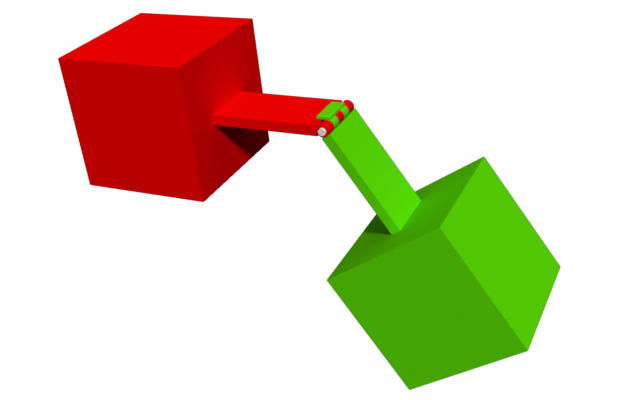

### 3.E | SwingLimit
The SwingLimit restricts one angular degree of freedom and acts like a special case of the EllipseSwingLimit, where the ellipse is a circle. Using this constraint where appropriate can help performance.

### 3.F | TwistLimit
The TwistLimit restricts one angular degree of freedom. Its behavior is similar to that of the TwistJoint, but it allows a range of twist values.

## **4 | Motors**
Motors do work to change the configuration of two connected entities. Every motor has two available modes, accessible through its settings property: velocity motor mode and servo mode.

Velocity motors try to reach a given relative velocity, while servos change velocity to achieve a position or orientation goal. The goal velocities and positions can be changed in the motor's settings property.

### 4.A | AngularMotor
The AngularMotor works on all three angular degrees of freedom.

In velocity mode, AngularMotors compare the current relative velocity between the entities to the goal relative velocity to determine the work to apply. In servo mode, they compare the relative orientation between the two entities to the goal relative orientation and work to correct the orientation using a SLERPed path.

### 4.B | LinearAxisMotor
The LinearAxisMotor works on a single linear degree of freedom. It has a similar setup to the LinearAxisLimit.

In velocity motor mode, the constraint attempts to push entity B's point with a given velocity along entity A's axis. In servo mode, entity B's point is pushed to a target distance from entity A's axis anchor.

### 4.C | RevoluteMotor
The RevoluteMotor works on one angular degree of freedom. It is made to complement the RevoluteAngularJoint.

In velocity mode, the RevoluteMotor compares the relative velocities the connected entities around the motor axis to the goal velocity. In servo mode, the angle around the motor axis between the attached entity axes is measured against the goal angle.

### 4.D | TwistMotor
The TwistMotor works on one angular degree of freedom. It is set up similar to the TwistJoint.

In velocity mode, the TwistMotor will try to achieve a given relative twisting velocity between the entities. In servo mode, the current twist angle is compared against the goal twist angle.

## **5 | SolverGroups**
SolverGroups are combinations of other SolverUpdateables. They generally provide an easier way to initialize groups of common constraints. Most SolverGroup types come with a set of active constraints and some other initially inactive constraints.

SolverUpdateable activity can be set using the IsActive property.

SolverGroups are not necessarily between two entities. Most of the existing types are composed of multiple two-entity Joints, but since SolverGroups are combinations of EntitySolverUpdateables, they can technically support any number of entities.

Custom SolverGroup types can be created to deal with a specific simulation's common joint combinations if needed.

### 5.A | LineSliderJoint
The LineSliderJoint is created from a PointOnLineJoint and a RevoluteAngularJoint. This leaves the entities with one linear sliding degree of freedom and one angular degree of freedom.

The LineSliderJoint also provides a LinearAxisLimit and a LinearAxisMotor, which are inactive by default.

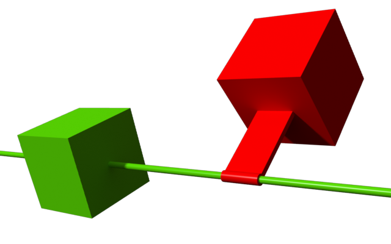

### 5.B | PlaneSliderJoint
The PlaneSliderJoint restricts a single linear degree of freedom. It is created from a PointOnPlaneJoint and a LinearAxisLimit and LinearAxisMotor for each of two axes on the plane. The limits and motors are inactive by default.

For more information and a picture, see the PointOnPlaneJoint.

### 5.C | PrismaticJoint
The PrismaticJoint allows a single sliding linear degree of freedom and zero angular degrees of freedom between two entities. It is created from a PointOnLineJoint and a NoRotationConstraint.

The joint also provides a LinearAxisLimit and a LinearAxisMotor which are initially inactive.

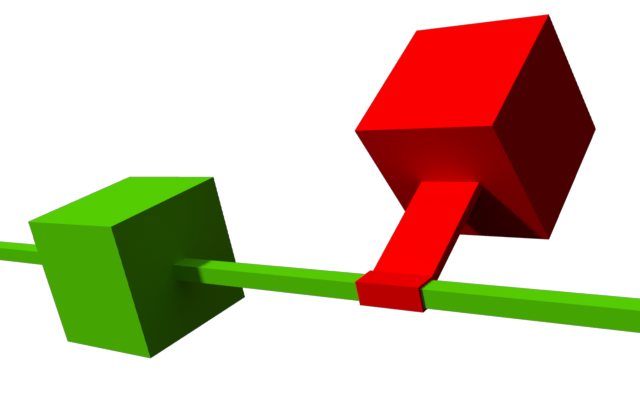

### 5.D | RevoluteJoint
The RevoluteJoint allows one angular degree of freedom between two entities. It is composed of a BallSocketJoint and RevoluteAngularJoint.

RevoluteJoints are commonly used for door hinges, elbows, and axis joints.

The joint also provides a RevoluteLimit and a RevoluteMotor which are initially inactive.

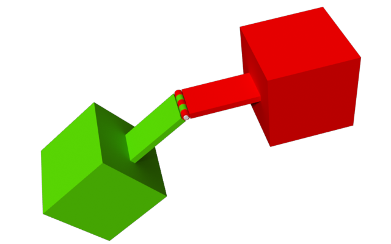

### 5.E | SwivelHingeJoint
The SwivelHingeJoint allows two angular degrees of freedom between two entities. It is comprised of a BallSocketJoint and a SwivelHingeAngularJoint.

The joint also provides control over the free degrees of freedom through its RevoluteLimit, RevoluteMotor, TwistLimit, and TwistMotor which are initially inactive.

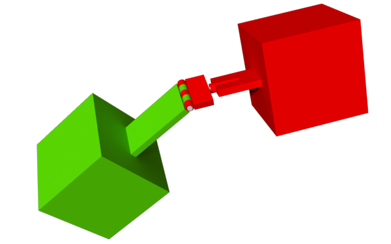

### 5.F | UniversalJoint
The UniversalJoint allows two angular degrees of freedom between two entities. It is comprised of a BallSocketJoint and a TwistJoint. It's useful for transferring twist motion around angles, such as in vehicle drive shafts. The UniversalJoint also provides a TwistLimit and TwistMotor which are initially inactive. These are not complementary to the TwistJoint; the TwistJoint should be inactive if either the limit or motor is active.

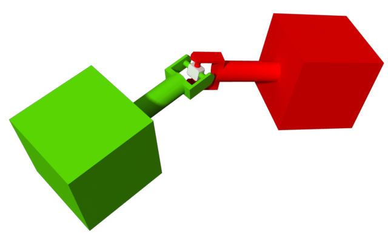

### 5.G | WeldJoint
The WeldJoint removes all degrees of freedom between two entities. It is composed of a BallSocketJoint and a NoRotationJoint.

### 5.H | CustomizableSolverGroup

CustomizableSolverGroups are a containerized version of the SolverGroup. SolverUpdateables can be added to the CustomizableSolverGroup without creating a new SolverGroup type if desired.

Combining multiple SolverUpdateables into a single CustomizableSolverGroup can have some organizational benefits and may improve multithreading performance. If there are multiple constraints connecting the same entities (which is common, particularly in ragdolls), they can be added to a single SolverGroup and the engine will only have to do bookkeeping on the parent CustomizableSolverGroup instead of every constraint individually.

## **6 | SingleEntityConstraints**

In addition to the common two-entity constraints, BEPUphysics provides some built-in single entity constraints.

### 6.A | MaximumAngular/LinearVelocityConstraint

The MaximumAngularVelocityConstraint and MaximumLinearVelocityConstraint are special constraints designed to prevent objects from exceeding specified speed limits. They are computationally heavy compared to directly clamping the velocity each frame but provide greater stability during interactions with other entities.

### 6.B | SingleEntityAngular/LinearMotor

The SingleEntityAngularMotor and SingleEntityLinearMotor provide a Motor-style interface for moving individual entities around. A goal velocity or goal position/orientation can be specified and the entity will be forced towards it.

## **7 | Using Constraints**

The following goes in more depth on how to configure constraints to match your simulation's needs.

### 7.A | Configuring Joint Bases

The constructor of a constraint will make an attempt at configuring the constraint based on its starting conditions. In many cases, this guess is sufficient; in more complicated joint configurations, sometimes the guess is incorrect. When this happens, the constraint can be reconfigured.

Many constraints have a joint Basis property, or a basis property for each connection. Each basis is an orthonormal basis. An example of an orthonormal basis can be formed from the Vector3.Right, Vector3.Up, and Vector3.Forward directions. Each axis is perpendicular to the other axes in the basis, and each axis is of unit length. The joint bases can have two or three dimensions, which means they have two or three axes.

Each basis is attached to an entity which rotates the basis's local axes into world space using the entity's orientation matrix. In constraints with only a single basis property, the convention is that the basis is attached to the first connection (ConnectionA property). Other constraints have a basis for both ConnectionA and ConnectionB.

Bases define constraints' working axes, free axes, and measurement axes. Working axes are axes aligned with a restricted degree of freedom. Free axes are aligned with allowed motion, like with a hinge's swing axis. Measurement axes are used to compute the current position or angle for joints and servos. The property summaries for each constraint basis provide information about what each axis represents.

Some constraints do not have a basis property; these generally are simpler constraints and have other configurable properties available that are equivalent to a one dimensional 'basis.'

### 7.B | Behavior Tuning
There are a variety of ways to tune the behavior of joints to match a simulation's requirements.

#### 7.B.a | Velocity and Position Error Coefficients
One way to adjust the behavior of a constraint is to adjust how it reacts to velocity and position error. Joints, joint limits, and servo motors all have spring settings. These can be found in the SpringSettings property of the Joints and JointLimits, and in the Settings.Servo.SpringSettings on motors.

The primary spring settings are stiffness and damping coefficients. These act like real-life spring coefficients that work against position error. The coefficients can handle very stiff values due to being solved as opposed to being applied explicitly. Stiffness and damping cannot both be zero at the same time because such values would imply an inactive constraint.

The advanced spring settings sub-property provides a different way of looking at the behavior through softness and an error reduction factor. The two approaches are almost functionally equivalent and the engine actually translates damping and stiffness coefficients into softness and error reduction factors internally. The softness/error approach can be better suited for certain types of constraints.

A softness of zero corresponds to a completely rigid response to velocity correction and higher values allow the constraint to be violated more. The error reduction factor is the amount of position error to feed back into velocity (from 0 to 1). Values closer to 1 reduce error faster than values close to 0.

Velocity motors do not have an error correction factor because there is no position to correct. However, they still have a softness setting. Velocity motors do not have an equivalent damping setting; softness in this context can be thought of as inverse damping. Usually, velocity motors have softness values close to zero for rigidity, which would result in very high damping values. If constraint instability is observed, a good first step is to soften up some of the involved constraints. The default stiffness/damping coefficients defaults can usually be reduced to deal with the instability while still maintaining similar behavior.

#### 7.B.b | Solver Iterations
SolverUpdateables are subject to the solver's iteration count. The solver iteration count is shared with the collision solver and can be changed by setting the Space.Solver.IterationLimit property. 
 Care should be taken when selecting an iteration count. The default value of 10 is usually sufficient for most simulations, but it can also be more than necessary for some simulations. If more speed is needed, try decreasing the iteration count and seeing if constraint and collision behavior is still satisfactory.

Iteration limits can also be defined on a per-SolverUpdateable basis using their SolverSettings property. The solver will only do up to its own IterationLimit, but a SolverUpdateable's SolverSettings can specify a lower number. In addition, it allows a minimum iteration count to be set. This defaults to 1 for all SolverUpdateables, but can be set to other values depending on the need. Increasing it will prevent the system from early-outing due to tiny impulses as quickly, increasing robustness while decreasing performance. Setting it to 0 will increase speed somewhat due to more early-outs, but can harm simulation quality a little.

#### 7.B.c | Impulse Limits
Constraints with position goals like Joints, JointLimits, and Motors in servo mode can only correct the position error as fast as their MaxCorrectiveVelocity property permits. This can be used to prevent objects from getting too much speed when trying to correct position error without dealing with the spring settings. By default, the maximum velocity is infinite. 

Motors also provide a MaximumForce property in their settings. Motors cannot exceed this force when trying to reach their velocity or position goals. By default, the maximum force is infinite.

One specific application of force-limiting is the simulation of joint friction. By setting a velocity mode AngularMotor's target velocity to zero and limiting the force, the joint will behave as if it were fighting friction to move.

### 7.C | Allowed Connections
TwoEntityConstraints require at least one of the two involved entities to be dynamic. Because kinematic entities have infinite inertia, constraints will not change their velocity. Connecting two kinematic entities would have no effect and is disallowed. 
 The TwoEntityConstraint base class, SolverUpdateable, follows a similar rule, but the engine does not actively enforce it at the SolverUpdateable level. SolverUpdateables in general should not modify involved kinematic entities. Due to the assumption that kinematic entities will not change because they have infinite inertia, the multithreading system will not attempt to obtain an exclusive lock. Using a SolverUpdateable to change a kinematic entity's properties while multithreading is active can lead to state corruption and race conditions.

The TwoEntityConstraint class has a special rule that allows them to take a null value for one of their connections. The null value tells the constraint to just use a kinematic 'world' entity (TwoEntityConstraint.WorldEntity). This entity does not belong to any space and is handled by special cases to prevent unnecessary bookkeeping.

### 7.D | Constraint Properties
All constraints provide an interface to their current state. Some of these are helpful in external logic.

The TotalImpulse property returns the current impulse applied by the constraint. This is the impulse required in an attempt to keep the constraint from being violated. One possible use of this information is testing force limits. If the value is too high, then the constraint could be 'broken,' possibly by setting the constraint's IsActive property to false or by removing it from the space.

The Error property returns how much the position constraint is being violated, if any. Constraints without a position goal (velocity motors) will return zero for their error. Similar to the above, one possible usage of this information is to 'break' constraints.

The RelativeVelocity property returns the velocity between the connected entities with respect to the constraint.

For advanced users, constraints also expose Jacobian and mass matrix data through the I1DJacobianConstraint, I2DJacobianConstraint, or I3DJacobianConstraint interface depending on the type.